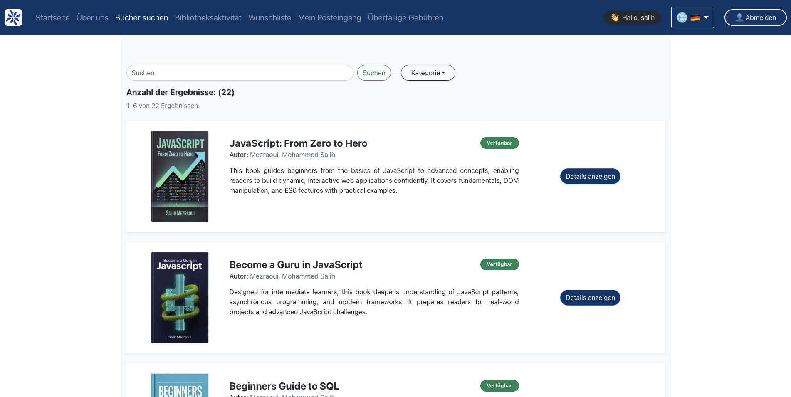
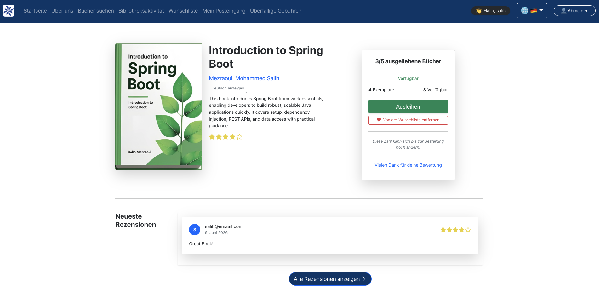
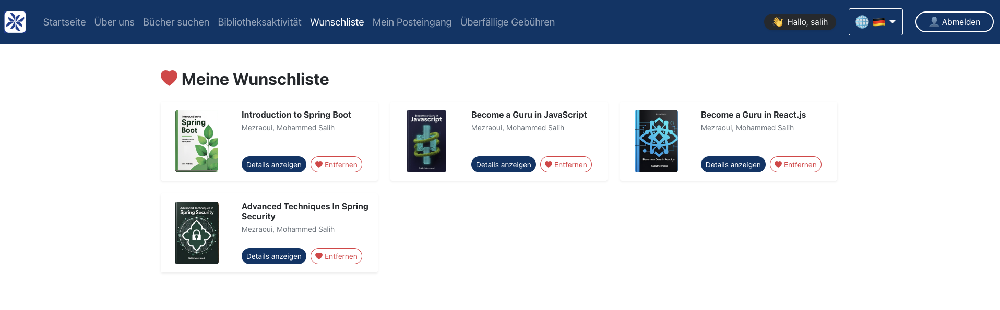
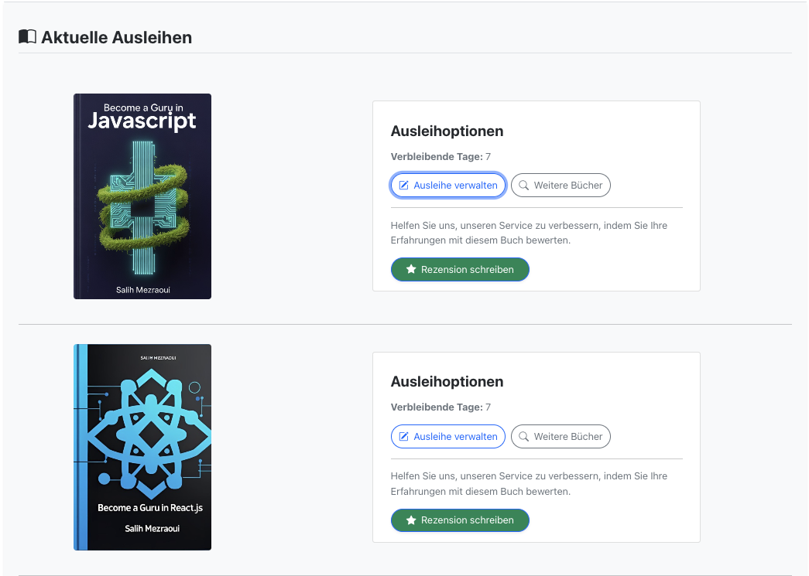
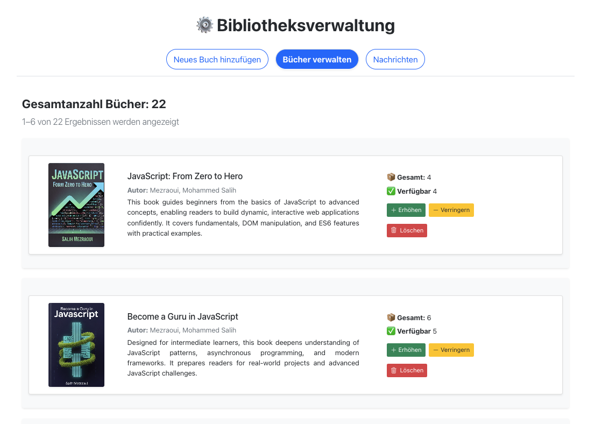

# LibraNova: Full-Stack Library Management System

[](https://github.com/SalihMezraoui/Libranova/actions/workflows/ci-cd.yml)

## Live Demo

👉 **[https://libranova-lac.vercel.app](https://libranova-lac.vercel.app)**

---

## Screenshots

| Home — Book Catalog | Book Detail & Wishlist |
|---|---|
|  |  |

| Wishlist | Shelf (Loans) |
|---|---|
|  |  |

| Admin — Book Management |
|---|
|  |

---

This project was developed as part of my **Bachelorarbeit (Bachelor's Thesis)**.

## Overview

**LibraNova** is a modern, responsive library management web application designed to enhance the user experience for both readers and administrators. Built with **React** (frontend) and **Spring Boot** (backend), the application enables users to search for books, borrow available books, submit reviews, and interact with real-time book data. Administrators can efficiently manage the catalog by adding, removing, or updating book quantities, as well as responding to user inquiries.

The application features a robust **authentication and authorization** system using **Auth0** (OAuth2, OpenID Connect, JWT), and integrates the **Stripe API** for secure payments related to overdue charges.

## Core Functionalities

### 👥 User Features
1. **User Registration & Login**
   - Secure login via **Auth0** (OAuth2 / OpenID Connect / JWT).
   - Role-based access (user/admin) enforced by **Spring Security**.

2. **Book Discovery & Borrowing**
   - Search books by title, author, or category.
   - View availability and borrow up to **five books** at a time.

3. **Book Details & Reviews**
   - View ratings and reviews for each book.
   - Submit personal reviews after borrowing.

4. **Wishlist**
   - Save books for later with a heart button on the book detail page.
   - View and manage all saved books from the dedicated Wishlist page.

5. **Shelf Page**
   - Track current borrowings and return history.
   - Extend borrow periods and return books manually.

6. **Inquiries**
   - Send inquiries to library admins.
   - Browse the response history of answered messages.

7. **Payments**
   - Pay overdue charges securely via **Stripe**.

### 🛠️ Admin Features
1. **Book Catalog Management**
   - Add and update book entries and quantities.
   - Delete books or update stock information.

2. **User Communication**
   - Read and respond to user messages and inquiries.

## Technologies Used

### 📌 Back-End
- **Spring Boot** — RESTful API development
- **Spring Security** with **Auth0** (OAuth2, OpenID Connect, JWT)
- **Spring Data JPA** with **MySQL**
- **Spring Data REST** — automatic repository exposure
- **Stripe API** — payment handling
- **HTTPS** with SSL/TLS encryption

### 🎯 Front-End
- **React** with **TypeScript**
- **Bootstrap** for responsive design
- **i18next** — multilingual support (English & German)
- **Auth0 React SDK** — authentication

### 🧪 Testing
- **JUnit** & **Mockito** — backend unit tests (service layer)
- **Postman** — manual API testing

### 🚀 Deployment & CI/CD
- **Railway** — backend + MySQL database hosting
- **Vercel** — frontend hosting
- **Docker** — backend containerization (Railway builds from Dockerfile)
- **GitHub Actions** — CI/CD pipeline (automated tests + deployment)

## CI/CD Pipeline

Every push to `main` triggers the following automated pipeline:

```
Push to main
    ↓
GitHub Actions:
  ├── Job 1: Backend unit tests (Java 17 / Maven)
  └── Job 2: Frontend build (Node 20 / React)
              ↓ both pass
  ├── Job 3: Deploy frontend → Vercel
  └── Railway: auto-deploys backend (waits for CI)
```

## How to Run Locally

### Prerequisites
- Java 17
- Node.js 20
- MySQL
- Auth0 account

### Backend

1. Clone the repo
2. Create a local MySQL database called `libranova_db`
3. Copy `.env.example` and fill in your values
4. Run:
```bash
cd 01-backend/spring-boot-library
./mvnw spring-boot:run
```

### Frontend

1. Copy `02-frontend/react-library-app/.env.example` to `.env`
2. Fill in your Auth0 and API values
3. Run:
```bash
cd 02-frontend/react-library-app
npm install --legacy-peer-deps
npm start
```

## Acknowledgments

Special thanks to my supervisor **Prof. Dr. Georg Schneider** for continuous support and academic guidance throughout the Bachelor thesis period.
